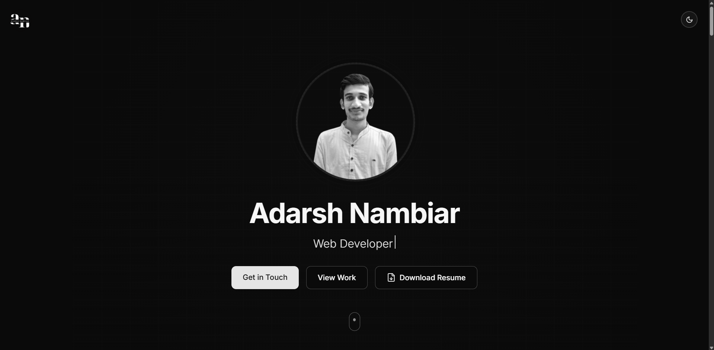

# Adarsh Nambiar - Portfolio Website



A modern, responsive portfolio website showcasing my skills, projects, and professional experience. Built with Next.js, TypeScript, and Framer Motion for seamless animations and transitions.

## 🔗 Live Demo

Visit the live portfolio at [adarshnambiar.me](https://adarshnambiar.me)

## ✨ Features

- **Interactive UI** with smooth animations and parallax effects
- **Responsive design** that works across all devices
- **Dark/Light mode** toggle
- **Dynamic sections** including:
  - Hero section with typing effect
  - About me
  - Skills and technologies
  - Projects showcase
  - Work experience timeline
  - Education and certifications
  - Contact form with Firebase integration
- **Performance optimized** with Next.js
- **Accessible** design following WCAG guidelines

## 🛠️ Technologies Used

- **Framework**: [Next.js](https://nextjs.org/) 14 (App Router)
- **Language**: [TypeScript](https://www.typescriptlang.org/)
- **Styling**: [Tailwind CSS](https://tailwindcss.com/)
- **Animations**: [Framer Motion](https://www.framer.com/motion/)
- **Database/Backend**: [Firebase](https://firebase.google.com/) (Firestore)
- **Deployment**: Vercel
- **Icons**: [Lucide Icons](https://lucide.dev/)

## 🚀 Getting Started

### Prerequisites

- Node.js 18.17.0 or later
- npm or yarn

### Installation

1. Clone the repository:
   ```bash
   git clone https://github.com/adarshnambiar12/portfolio.git
   cd portfolio

2. Install dependencies:

    ```bash
    npm install
    # or
    yarn install

3. Create a .env.local file in the root directory with your Firebase configuration:

    ```Code
    NEXT_PUBLIC_FIREBASE_API_KEY=your_api_key
    NEXT_PUBLIC_FIREBASE_AUTH_DOMAIN=your_auth_domain
    NEXT_PUBLIC_FIREBASE_PROJECT_ID=your_project_id
    NEXT_PUBLIC_FIREBASE_STORAGE_BUCKET=your_storage_bucket
    NEXT_PUBLIC_FIREBASE_MESSAGING_SENDER_ID=your_messaging_sender_id
    NEXT_PUBLIC_FIREBASE_APP_ID=your_app_id

4. Start the development server:

    ```bash
    npm run dev
    # or
    yarn dev

5. Open http://localhost:3000 in your browser to see the result.